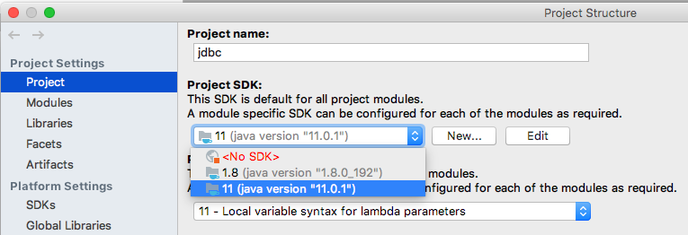

# Maven

## Prerequisites

JDK and Maven installed (see [Installation](./README#Installation))

## IntelliJ

These steps show how you open the pre-configured IntelliJ project.

1. Download and unzip the Maven project zip (e.g., `jdbc.zip`)
2. Start IntelliJ and select `Open`
3. Choose the *folder* of the project (e.g., `jdbc`) and click open
4. Right-click `src/main/java/se.chalmers.dm/JDBCTestDriver.java` and choose `Run 'JDBCTestDriver.main()` to run the code

## Command Line

1. Locate project: `cd /path/to/jdbc`
2. Compile (automatically downloads dependencies): `mvn compile`
3. Run *JDBCTestDriver* `mvn exec:java -D"exec.mainClass"="se.chalmers.dm.JDBCTestDriver"`

## Switch Project JDK

If you get an error message such as "Project SDK is not defined"

1. Go to `File > Project Structure ...`
2. Select an installed SDK:

    
